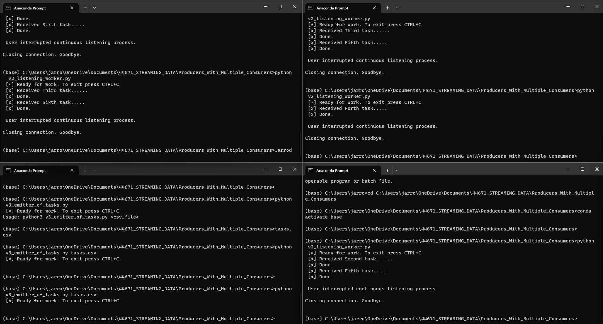

# Project Title: Streaming Multiple Consumers

## Author: Jarrod Sims

Project Description: This project uses RabbitMQ to distribute tasks to multiple workers. One process will create task messages. Multiple worker processes will share the work. 

## Before You Begin

1. Fork this starter repo into your GitHub.
1. Clone your repo down to your machine.
1. View / Command Palette - then Python: Select Interpreter
1. Select your conda environment. 

## Read

1. Read the [RabbitMQ Tutorial - Work Queues](https://www.rabbitmq.com/tutorials/tutorial-two-python.html)
1. Read the code and comments in this repo.

## RabbitMQ Admin 

RabbitMQ comes with an admin panel. When you run the task emitter, reply y to open it. (Python makes it easy to open a web page - see the code to learn how.) Note on versions two and three change the value of `SHOW_OFFER` to toggle opening RabbitMQ Admin.

## Reference

- [RabbitMQ Tutorial - Work Queues](https://www.rabbitmq.com/tutorials/tutorial-two-python.html)

## Screenshot

See a running example with at least 3 concurrent process windows here:

